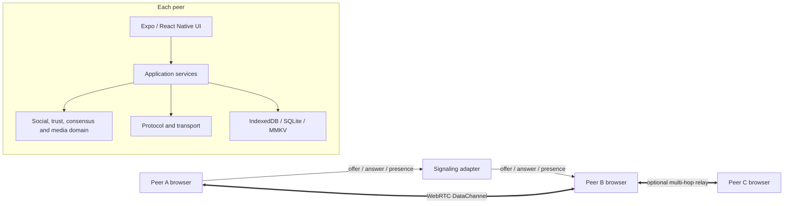

# Synpeer

Synpeer is an experimental local-first peer-to-peer social network built with
TypeScript, Expo and WebRTC.

> **Status: operational alpha, not production-ready.** Do not use Synpeer for
> sensitive or irreplaceable data. The protocol and persisted schemas may still
> change.

The current web runtime can create cryptographic identities, connect browser
peers, replicate social data incrementally, relay encrypted chat across a peer
graph and transfer media in verified chunks. Supabase Realtime or the included
ephemeral WebSocket server can coordinate WebRTC signaling. Social content is
not intentionally persisted by either signaling adapter.

## What Works

| Capability      | Current state                                                                 |
| --------------- | ----------------------------------------------------------------------------- |
| Local identity  | Ed25519 identity, signatures, export and versioned backup                     |
| Social data     | Profiles, follows, posts, edits, deletions, likes, comments and notifications |
| Peer transport  | WebRTC DataChannel in the web runtime                                         |
| Signaling       | Supabase Realtime, self-hosted WebSocket and same-browser BroadcastChannel    |
| Synchronization | Incremental signed replication with deduplication and retry                   |
| Multi-hop       | TTL-limited gossip and durable relay queues                                   |
| Chat            | Destination-encrypted payloads, delivery/read receipts and offline outbox     |
| Media           | Deterministic chunking, hash validation, resume and local cache               |
| Persistence     | IndexedDB/SQLite adapters plus versioned migrations                           |
| Diagnostics     | Structured logs, runtime health and developer inspectors                      |

The automated mesh scenarios exercise four browser peers and include
partition/recovery and durable chat relay cases. This is evidence of the
implemented paths, not a guarantee for every NAT, browser or hostile network.

## Architecture



The signaling service helps peers discover each other and exchange WebRTC
session descriptions. Posts, chat payloads and media use the WebRTC data path
after a channel opens. A TURN server may relay encrypted WebRTC packets when a
direct route is impossible. Intermediate Synpeer peers may relay protocol
messages when multi-hop routing is used.

See [Architecture](docs/architecture.md), [Privacy](docs/privacy.md) and the
[Threat model](docs/security/threat-model.md) for the exact trust boundaries.

## Quick Start

### Requirements

- Node.js `^20.19.4`, `^22.13.0`, `^24.3.0` or newer supported releases
- npm
- A modern Chromium-based browser for the currently validated P2P path

### Run locally

```bash
git clone https://github.com/xxsamboladiones/Synpeer.git synpeer
cd synpeer
npm ci
copy .env.example .env
npm run web
```

PowerShell users can create the local environment file with:

```powershell
Copy-Item .env.example .env
```

Open the Expo URL, create an identity and use the Peers screen to create or join
a private Synpeer network.

### Signaling options

**Supabase Realtime**

Set these values in `.env`:

```dotenv
EXPO_PUBLIC_SUPABASE_URL=https://your-project.supabase.co
EXPO_PUBLIC_SUPABASE_ANON_KEY=your-publishable-anon-key
```

The current adapter uses Realtime Broadcast and Presence. It does not require a
SQL schema and does not call Postgres storage APIs. The URL and publishable/anon
key are public client configuration, not secrets. Never expose a
`service_role` or secret key.

**Self-hosted ephemeral signaling**

On a machine reachable by both peers:

```bash
npm run signaling
```

Then configure each app:

```dotenv
EXPO_PUBLIC_SYNPEER_SIGNALING_URL=ws://192.168.1.10:8787
```

The included server keeps online peers, private-network membership and pending
signals in memory. Restarting it clears that state. It is a development and
testing adapter, not a hardened public signaling service.

The full two-peer and four-peer procedures are in [Demo guide](docs/demo.md).

## Security Model

- Ed25519 signs identities and signed social/protocol records.
- Chat payloads are encrypted for the destination using an X25519-derived key
  and AES-256-GCM.
- Relays receive routing metadata and ciphertext. Tests assert that chat
  plaintext is absent from relay payloads.
- Media and chunks are accepted only after deterministic hash validation.
- The private identity key is intended to remain on the originating peer and is
  not sent by the signaling or social replication paths.

Important limitations:

- The private key is currently stored locally as key material without strong
  encryption at rest. A compromised browser profile, device or script can
  extract it.
- Identity backup files contain private key material. Their checksum detects
  accidental corruption but does not encrypt or authenticate the backup.
- The cryptographic design has not received an independent security audit.
- Signaling providers can observe connection metadata and SDP/ICE signaling.
- TURN operators can observe transport metadata and relay encrypted WebRTC
  traffic.
- Downloaded files, including archives and executables, are untrusted bytes.
  Synpeer never intentionally executes them.

Read [SECURITY.md](SECURITY.md) before reporting a vulnerability.

## Data and Supabase

Synpeer has no intentional analytics or advertising telemetry in the current
codebase. Structured diagnostic logs remain in the app/runtime.

When Supabase signaling is enabled, Synpeer sends short-lived signaling,
presence and private-network coordination events through Realtime. Supabase is
not used by the current adapter as a database for posts, chat bodies or media.
Provider-side operational logs and retention remain subject to the deployment's
configuration and provider policy.

## Validation

Run the complete local verification:

```bash
npm run verify
```

Or run each layer:

```bash
npm run security:scan
npm run lint
npm run typecheck
npm test -- --runInBand
npm run export:web
```

Mesh browser scenarios:

```bash
npx playwright install chromium
npm run test:e2e:mesh
npm run test:e2e:mesh:repeat
```

## Known Limitations

- Browser-to-browser connectivity still depends on NAT, firewall, STUN/TURN and
  browser behavior. TURN deployment and validation need broader coverage.
- Local identity keys and exported backups need password-based encryption and
  platform keystore integration.
- Abuse resistance, quotas, peer scoring and malicious-input hardening are not
  complete.
- Protocol compatibility and data migrations need long-lived release testing.
- Media source selection, signed availability, backpressure, repair and garbage
  collection are still being hardened.
- The native mobile transport path has not reached the same validation level as
  the web path.
- Legacy compatibility code remains in a few modules and is being removed
  incrementally.
- `npm audit` currently reports unresolved transitive advisories in the
  Expo/lint/test toolchain. The automatic forced remediation proposes
  incompatible major-version changes, so these require upstream-compatible
  upgrades rather than a forced downgrade.

The [Alpha release checklist](docs/open-source-release-checklist.md) tracks the
remaining publication work.

## Contributing

Issues, reproducible network failures, protocol review and security analysis are
welcome. Start with [CONTRIBUTING.md](CONTRIBUTING.md). Protocol changes should
include compatibility notes, validation and multi-peer tests.

## License

Licensed under the [Apache License 2.0](LICENSE).
