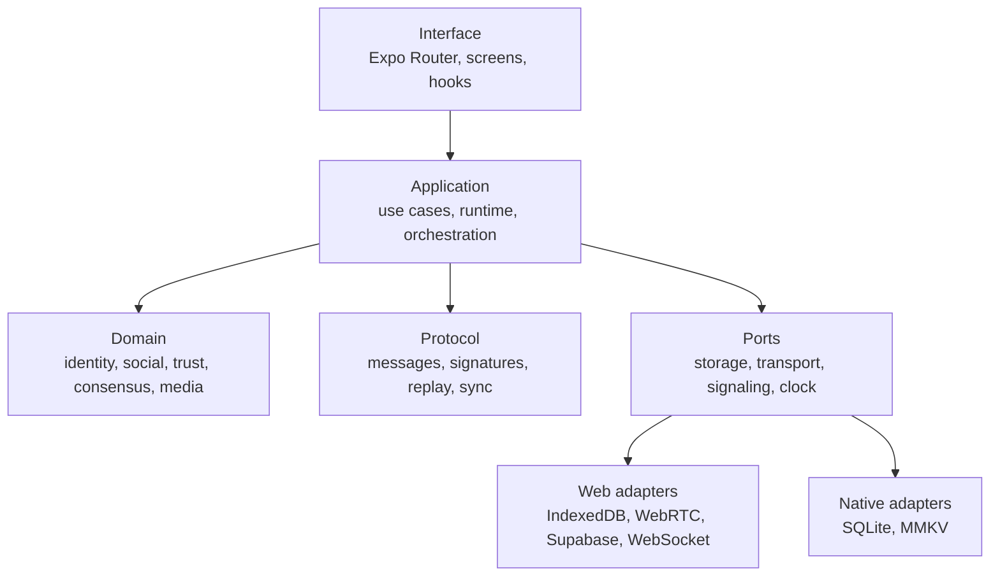
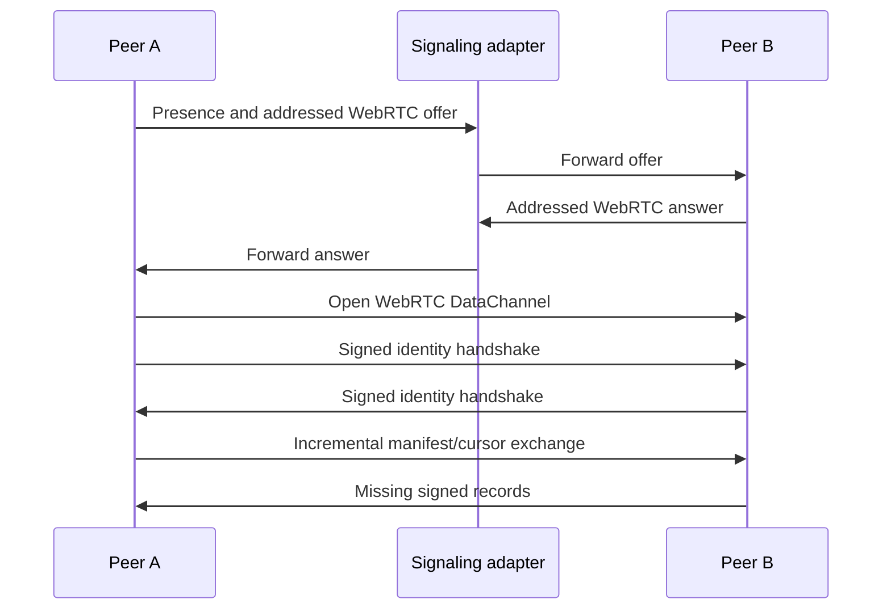

# Synpeer Architecture

## Scope

Synpeer is local-first: each peer owns an identity, persists its local state and
exchanges signed records with trusted peers. The currently validated distributed
path is the web runtime using WebRTC DataChannels.

## Layers

- **Domain** contains state transitions, deterministic identities/hashes,
  validation and conflict rules.
- **Application** coordinates repositories, engines, queues, runtime lifecycle
  and user-facing cases.
- **Protocol** defines versioned network envelopes, synchronization records,
  signed packets and chat/media messages.
- **Infrastructure** implements persistence, cryptography, signaling and
  transport for a platform.
- **Interface** renders state and invokes application cases rather than owning
  distributed rules.

The current codebase is still completing this separation. `ApplicationRuntime`
remains a compatibility facade for consumers while composition is moved toward
explicit dependencies.

## Connection Flow

The signaling adapter can be:

- Supabase Realtime Broadcast and Presence;
- the included in-memory WebSocket server;
- BroadcastChannel for same-browser/local development.

The Supabase adapter does not call Postgres table APIs. The WebSocket adapter
keeps its coordination state in process memory.

## Social Replication

Profiles, follows, posts, reactions, comments, notifications and chat events are
persisted locally and represented as signed or integrity-checked records.
Synchronization compares incremental state rather than replacing the full local
database. Message IDs, content hashes and repository constraints prevent normal
duplicates.

Conflict handling depends on the entity:

- signatures establish the author;
- deterministic identifiers establish record identity;
- version/timestamp rules select newer valid mutations;
- local priority and tombstones prevent stale remote state from resurrecting
  deleted content.

## Multi-Hop

When the destination is not directly connected, eligible messages can be
forwarded through trusted peers. Gossip metadata includes a bounded TTL and
deduplication identity. Durable queues keep retry state and delivery/read
receipts.

For chat, the sender encrypts the body for the final recipient before relay.
Intermediate peers need routing metadata and see ciphertext. They are not
assumed to be anonymous and can still observe traffic shape, peer identifiers
and timing.

## Media

Media is split deterministically into chunks. Each chunk and the reconstructed
object are validated against expected hashes. The repository tracks partial
availability so downloads can resume and duplicate chunks do not need to be
stored again.

Large transfers are constrained by message and chunk limits. Source
availability scoring, malicious-source quarantine, backpressure, repair and
garbage collection are active hardening areas.

## Persistence

- Web structured data uses IndexedDB-compatible repositories and migrations.
- Native structured data uses SQLite adapters.
- Small local settings and identity records use the platform storage service,
  currently backed by MMKV where available.
- Media metadata/chunks use dedicated repositories and cache policies.

Data read from persistence is validated before use in the newer repositories.
Some legacy records still require migration compatibility.

## Runtime and Observability

`ApplicationRuntime` coordinates startup, shutdown, health, repositories,
networking and background recovery. Initialization is shared across concurrent
callers to avoid duplicate bootstrap.

Structured logs include scope, event, error code and non-sensitive context.
Health snapshots distinguish runtime state and component degradation. Logs are
diagnostic output, not an intentional telemetry pipeline.

## Known Architectural Debt

- Runtime composition still exposes compatibility accessors.
- Native networking is less validated than the web WebRTC path.
- TURN and hostile-NAT coverage is limited.
- Several legacy protocol or compatibility modules remain pending removal.
- Distributed trust and consensus are not equivalent to a Byzantine-secure
  global consensus system.
