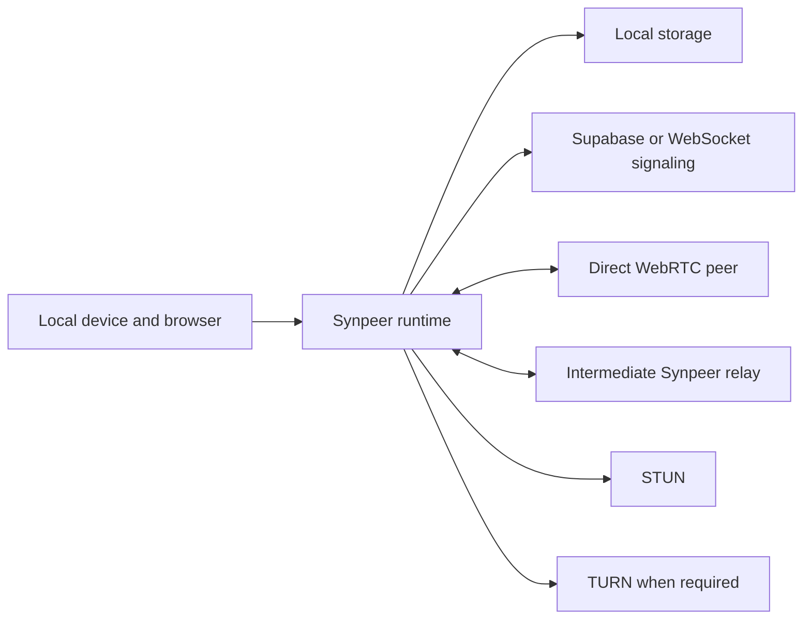

# Initial Threat Model

## Status

This is an initial engineering threat model for an experimental alpha. It has
not been independently audited.

## Assets

- private identity keys;
- identity backups;
- chat plaintext and encryption keys;
- signed social records and tombstones;
- trusted-peer decisions;
- media bytes and integrity metadata;
- durable outbox, receipts and replay state;
- local storage and migration state.

## Trust Boundaries

The local device is trusted only while its browser, operating system and
extensions remain uncompromised. Direct peers and relay peers are not trusted
to send valid data. Signaling, STUN and TURN services are trusted for
availability only, not for social-data confidentiality.

## Implemented Protections

- Ed25519 signatures authenticate identity and signed records.
- X25519-derived keys plus AES-256-GCM protect destination chat payloads.
- Canonical serialization and deterministic IDs reduce ambiguity.
- Version, timestamp, TTL, sender and size checks reject invalid network
  envelopes.
- Replay/deduplication state prevents normal duplicate processing.
- Chunk and whole-object hashes detect media corruption.
- Durable queues and signed receipts make delivery state explicit.
- Structured logging redacts configured sensitive fields.

## Explicit Non-Guarantees

- No anonymity or traffic-analysis resistance.
- No guarantee against a compromised local browser, extension or operating
  system.
- No strong encryption at rest for the local private key.
- No encryption for identity backup files.
- No independent cryptographic or protocol audit.
- No complete Sybil, spam, malware or denial-of-service resistance.
- No guarantee that every NAT/firewall pair can connect without a suitable TURN
  deployment.
- No Byzantine-secure global consensus.

## Threats and Current Controls

### Malicious network messages

Inputs are parsed, schema-checked, size-limited, versioned and deduplicated
before handlers. Signatures are checked for authenticated records. Parser and
resource-exhaustion fuzzing remain incomplete.

### Replay

Message IDs, TTL and replay repositories cover the current protocol paths.
Durability and cleanup need continued validation across migrations and long
offline periods.

### Identity theft

Remote peers cannot derive the private key from the public identity. Local key
material is currently stored without strong encryption at rest, so local
compromise or accidental backup exposure can steal the identity.

### Relay inspection or modification

Chat bodies are encrypted for the final recipient and authenticated by
AES-GCM. Relays see metadata and ciphertext. Signed final receipts prevent a
relay from claiming final delivery as the recipient. Relays can still drop,
delay or correlate traffic.

### Signaling compromise

A signaling operator can observe and disrupt session establishment. The signed
identity handshake is expected to bind the resulting peer session to an
identity, but signaling can still deny service, replay stale coordination or
expose network metadata.

### Corrupt or hostile media

Hash checks reject changed chunks and reconstructed objects. A valid file can
still be malicious. Synpeer must not auto-execute content, and users must
confirm downloads. Malware scanning and abuse controls are not complete.

### Resource exhaustion

Message/chunk size limits, retry backoff and cache limits provide partial
control. Peer quotas, global backpressure, disk-pressure policy and hostile
fan-out testing remain incomplete.

### Persistence corruption

Versioned migrations and runtime validators cover newer repositories. Recovery
from every partial-write or browser quota failure is not guaranteed.

## Security Roadmap

1. Encrypt identity keys and backups using a user secret and platform keystore
   where available.
2. Complete signed media availability, source scoring and quarantine.
3. Add global backpressure, peer quotas and bounded queues.
4. Fuzz network parsers, migrations and media reconstruction.
5. Validate TURN deployments and hostile NAT scenarios.
6. Remove inactive legacy security/protocol modules.
7. Obtain external cryptographic and protocol review before a stable release.
